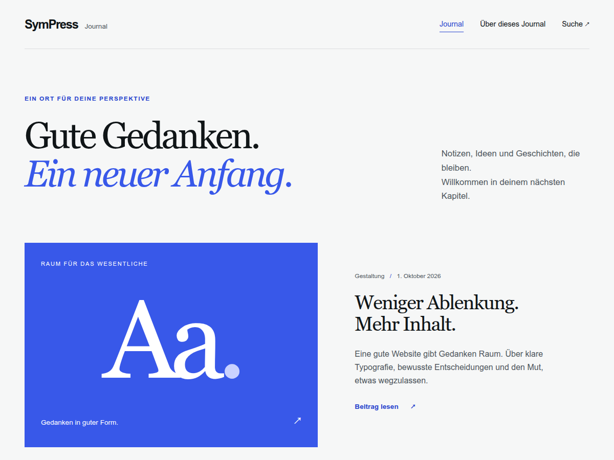

# SymPress Starter Theme

A WordPress starter theme with Symfony, Twig, Tailwind CSS 4 and Webpack Encore 7.
Includes an editorial layout, editor styles and a Composer-managed build workflow.



## Requirements and installation

PHP 8.5, Composer 2, WordPress 6.6+ and Node within the ranges in `package.json`.
The site's MU plugin must boot `SymPress\Kernel\Kernel\SiteKernel` before loading
the theme. The site owns autoloading, the container and the Twig environment.

From the site root, register the GitHub repository and install the stable package
(the theme is distributed through GitHub tags, not currently listed on Packagist):

The repository is currently private. Composer needs GitHub credentials with
repository access, supplied through the site's Composer authentication (for
example `COMPOSER_AUTH` in CI). No repository visibility change is required.

```sh
composer config repositories.sympress-theme vcs https://github.com/SymPress/theme-starter.git
composer require sympress/theme-starter:^1.0
```

Allow `composer/installers` and configure the site's installation path:

```json
{
  "extra": { "installer-paths": {
    "public/wp-content/themes/{$name}/": ["type:wordpress-theme"]
  } },
  "config": { "allow-plugins": { "composer/installers": true } }
}
```

Runtime dependencies are stable Assets `^1.2`, Kernel `^1.1` and Twig Bundle
`^1.2`. Production asset compilation uses `sympress/asset-compiler` in the site
project; see [deployment](docs/deployment.md). Source archives contain no built
assets and are not standalone WordPress ZIP installations.

For customization, clone the theme into `packages/theme-starter`, register that
directory as a Composer path repository and require `sympress/theme-starter:@dev`.
Run `npm ci && npm run build` there, then activate `sympress-starter` through
WordPress. The package's `extra.kernel` metadata discovers its theme bundle;
`prependExtension()` registers its slug with Twig Bundle.

## Development and customization

```sh
npm ci
npm run dev       # development build
npm run watch     # watch changes
npm run build     # production assets
```

| Concern | Source |
| --- | --- |
| Colors, typography and spacing | `theme.json` |
| Tailwind aliases for WordPress presets | `resources/css/tailwind-theme.css` |
| Frontend styles | `resources/css/site.css`, `resources/css/app.css` |
| Editor styles | `resources/css/editor.css` |
| Twig templates and menu/pagination markup | `resources/views/` |
| Context and template selection | Twig Bundle's WordPress layer |
| Theme setup, assets and metadata | `src/WordPress/Theme.php` |
| Example block pattern | `patterns/editorial-intro.php` |

WordPress provides `--wp--preset--*` variables from `theme.json`. There is no token
generator. Add corresponding aliases to `tailwind-theme.css` for named utilities.
Use complete Tailwind class names. Editor styles remain separate from frontend
Preflight. Encore's runtime public path is `auto`; the relative manifest-path
warning is intentional and lazy chunks resolve from their script URL.

## Twig and WordPress

`@theme` searches child views before parent views. The layout extends
`@wordpress/document.html.twig`. The native template loader runs once; Twig
Bundle captures the hierarchy and selects Twig through `template_include`.
Plugin PHP overrides and more specific native PHP templates retain precedence;
equal specificity prefers Twig. `index.php` is a 503 configuration guard.

The `posts` collection is lazy, countable and repeatable. Iterate it directly so
WordPress template tags and plugin content filters see the current global post.
Use `loop.first` for featured layouts instead of materializing with `first` or
`slice`. Posts expose `content`, `excerpt(30)`, `thumbnail(size, attributes)`,
`categories` and `meta(key)`. Menus and pagination are objects, with markup owned
by the theme. ACF metadata conversion is optional and lives in Twig Bundle.
Twig Bundle 1.2 adds public author profiles, lazy `post.author`/`post.terms(taxonomy)`,
model constructor DI and WordPress helpers for admin rendering. See
[UPGRADE-1.1.md](UPGRADE-1.1.md) before upgrading an existing site.

Use `sympress/twig/context` and `sympress/twig/template_candidates` for filters.
Autoconfigured services implement `TemplateComposerInterface`, optionally with
`#[AsTemplateComposer(templates: ['page-*'], priority: 10)]`. Register services in
the theme bundle's `loadExtension()`. Custom editor templates live in
`resources/views/custom/*.html.twig` with `Template Name` and optional
`Template Post Type` headers. They are registered in admin and frontend requests.

Inject `SymPress\TwigBundle\WordPress\ThemeRenderer` for explicit rendering or
`renderBlock('singular', 'content', $context)`. For REST/AJAX/CLI obtain candidates
from `TemplateHierarchy::forQuery($query)` and context from
`QueryContextProvider::context($query)`.

Twig escapes plain text and URLs once. Only WordPress-rendered HTML is trusted;
the lint rule rejects `raw`. Protected posts display the password form and
withhold protected metadata/images/comments. Excerpts honor native filters and
expand public reusable blocks with cycle, depth and reference limits. Metadata
reads stored plain text without rendering content.

See the [WordPress API reference](https://github.com/SymPress/twig-bundle/blob/main/docs/wordpress.md),
[upgrade guide](UPGRADE-0.2.md), [translations](languages/README.md) and
[stability policy](docs/stability.md). When renaming, update the Composer name,
installer name, registered slug, kernel entry, namespace, textdomain, style header
and asset-compiler allowlist together, then rebuild the site's caches.

## Verification

```sh
composer install
composer qa
php scripts/extract-translations.php --check
npm ci
npm run build
npx playwright install --with-deps chromium
npm run test:chunks
```

The [disposable fixture](tests/site/README.md) adds real WordPress and browser
checks. Run them sequentially because they share a database. Automated tests do
not replace manual screen-reader testing. The fixture must never be deployed.

## Deployment and extension hooks

Deploy compiled `build/` with PHP, Twig views, source CSS, patterns, translations,
`style.css`, `theme.json` and `screenshot.png`; the site manages runtime Composer
dependencies. Invalid manifests produce an admin notice and readable CSS fallback.
Manifest paths and symlinks outside `build/` are rejected. Frontend and optional
editor entries are validated independently.

Disable small CSS inlining with `sympress_starter/inline_styles`. The plain-text
meta-description fallback stands down for common SEO plugins. Use
`sympress_starter/meta_description_enabled` to disable it or
`sympress_starter/meta_description` to customize its text. Protected content,
previews, search and 404 pages are excluded.

See [production deployment and cache warmup](docs/deployment.md),
[security](SECURITY.md) and [changelog](CHANGELOG.md).
Licensed under [GPL-2.0-or-later](LICENSE.md).
